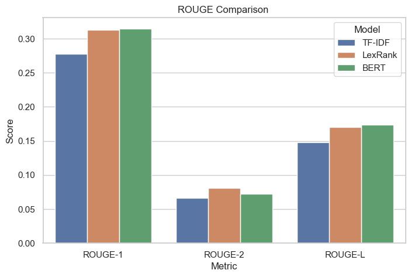
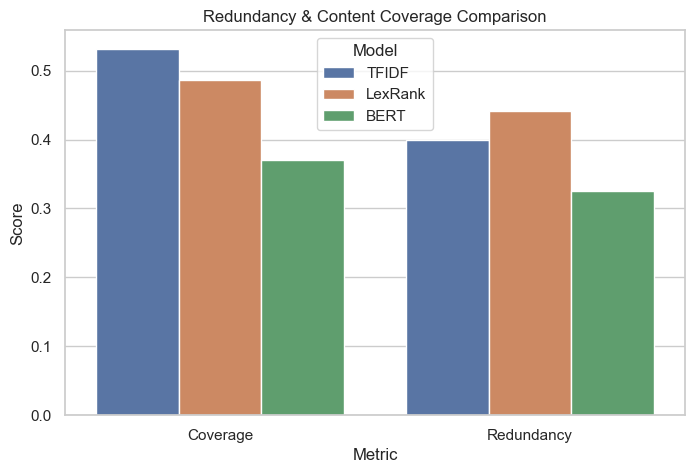
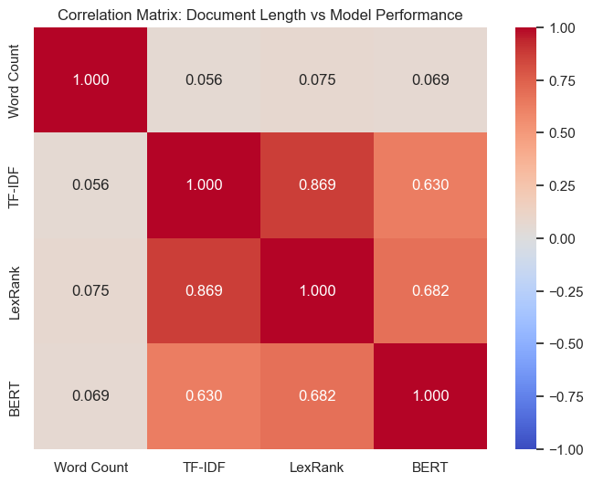

# Comparative Analysis of Extractive Text Summarization Methods on Long Documents

MSc Computer Science final semester research project — a comparative analysis of extractive text summarization methods - TF-IDF, LexRank, and a cluster-based approach using Sentence-BERT (SBERT) embeddings on long WikiHow documents.

This is a **comparative evaluation study**, not a novel model or architecture proposal. It compares exisiting summarization methods - a statistical baseline, graph-based, and embedding-based extractive summarization approaches, evaluates each of those ,methods using standard ROUGE metrics, coverage and redundancy measures and analyzes the results.

## Motivation / Research Gap

Most extractive summarization research is evaluated on CNN/DailyMail Datasets (which are short-to-medium length documents) and is considered as the gold standard for extractive summarization. But CNN/DailyMail Dataset follows an 'inverted pyramid' structure and has a Lead-3 bias, as news articles are written with the most important information at the top of the article. This makes the model, trained on CNN/DailyMail Datasets to generate summary using the first 3 lines of the article and thus it doesn't generalize well to other documents where information is spread throughout the document.

WikiHow Dataset was used to address this gap. WikiHow has long and structured articles. It is also resistant to Lead-3 bias commonly observed in standard news-based datasets like CNN/DailyMail. In WikiHow articles, key information (its "Steps") is spread across the entire document, making it a more rigorous test of whether a summarization method can identify globally relevant content in long documents.

## Objective

1. Compare different extractive summarization approaches spanning statistical, graph-based, and embedding-based paradigms
2. Evaluate their performance using standard ROUGE metrics
3. Analyze limitations such as redundancy and coverage 


## Methods Compared

| Method | Type | Approach |
|---|---|---|
| **TF-IDF** | Statistical baseline | Sentences scored by summed TF-IDF values; top 5 selected |
| **LexRank** | Graph-based | Builds Sentence similarity graph (cosine similarity on TF-IDF vectors), ranked via eigenvector centrality |
| **SBERT** | Embedding-based | Sentences encoded via `all-MiniLM-L6-v2`, clustered with K-Means, selected one representative sentence per cluster |

## Dataset

- **Source:** [WikiHow dataset](https://github.com/HiDhineshRaja/WikiHow-Dataset) — ~215,000 articles
- **Filtering:** Articles with fewer than 800 words excluded → ~30,700 long documents remain
- **Sample:** 500 randomly sampled articles (fixed random seed for reproducibility)
- **Reference summaries:** WikiHow's bolded step headlines, used as ground-truth summaries

Note: 800+ words was considered as long document for this research.

## Evaluation Metrics

- **ROUGE-1 / ROUGE-2 / ROUGE-L** (F-measure) — standard summarization overlap metrics
- **Coverage** — ROUGE-1 recall, measures fraction of reference words in generated summary
- **Redundancy** — mean pairwise cosine similarity between summary sentences (via SBERT embeddings)

Note: In addition, document length analysis was done using scatter plots, regression plots, and correlation matrix.

## Results

Average scores across 500 sampled documents:

| Method | ROUGE-1 | ROUGE-2 | ROUGE-L | Coverage | Redundancy |
|---|---|---|---|---|---|
| TF-IDF | 0.250 | 0.070 | 0.136 | **0.532** | 0.399 |
| LexRank | 0.278 | **0.078** | 0.152 | 0.487 | 0.442 |
| SBERT | **0.309** | 0.072 | **0.166** | 0.370 | **0.325** |

## Visualization  

1. ROUGE Comparison (Bar Chart)



2. Redundancy & Coverage Comparison (Bar Chart)



3. HeatMap - Correlation Analysis (Word count vs ROUGE-1)



## Key findings

- **SBERT achieved the best overall ROUGE performance** and produced the least redundant summaries, but had the lowest lexical coverage — likely because ROUGE is a purely lexical metric and doesn't credit semantically-equivalent but differently-worded sentences.
- **LexRank achieved the highest ROUGE-2**, suggesting stronger bigram overlap than BERT. ROUGE-2 measures exact bigram overlap, which may favors extractive methods that choose sentences resembling the reference summary wording.
- **TF-IDF had the highest coverage but also higher redundancy**, suggesting ROUGE-based coverage does not fairly represent SBERT's actual semantic coverage.
- **LexRank had highest redundancy**. It selects central sentences that are highly connected to many other similar sentences. This results in higher redundancy.
- **No evidence of performance degradation with increasing document length** within the 800+ word range studied.
- Correlation Analysis revealed **Negligible relationship between document length and ROUGE scores** of summarization methods suggesting document length (exceeding 800+ words) to have negligible influence on the performance of summarization model.

**Conclusion:** 
Overall, SBERT performed best of the three methods but only had modest ROUGE score gain over LexRank suggesting that Long document summarization such as of WikiHow articles remains a challenging task. 

Full analysis, visualizations, and discussion are available in the [dissertation report](./report/Research-Dissertation.pdf).

## Repository Structure

```
├── notebooks/
│   ├── 01_tfidf.ipynb           # TF-IDF summarizer + evaluation
│   ├── 02_lexrank.ipynb         # LexRank summarizer + evaluation
│   ├── 03_sbert.ipynb           # SBERT summarizer + coverage/redundancy
│   └── 04_visualization.ipynb   # All charts and correlation analysis
├── data/
│   └── final_df.pkl             # 500-article evaluation sample (pickled)
├── results/
│   ├── results_table.jpg
│   ├── summary-comparison-table.jpg
│   └── Plots/                  # Saved visualization outputs
├── report/
│   └── Research-Dissertation.pdf
├── requirements.txt
└── README.md
```

> **Note:** The full WikiHow dataset (~580MB) is not included in this repository. Download `wikihowAll.csv` from the [official dataset repository](https://github.com/HiDhineshRaja/WikiHow-Dataset) and place it in `data/raw/` to reproduce results from scratch.

## Setup & Reproduction

```bash
# Clone the repo
git clone https://github.com/Vivek-07-dev/extractive-summarization-wikihow.git
cd extractive-summarization-wikihow

# Create virtual environment
py -3.11 -m venv venv-name
venv-name\Scripts\activate       # Windows
# source venv/bin/activate   # macOS/Linux

# Install dependencies
pip install -r requirements.txt

# Run notebooks in order: 01 → 02 → 03 → 04
```

## Tools & Libraries

- `pandas` — data loading and preprocessing
- `scikit-learn` — TF-IDF vectorization, K-Means clustering
- `sumy` — LexRank implementation
- `sentence-transformers` — SBERT embeddings (`all-MiniLM-L6-v2`)
- `rouge-score` — ROUGE evaluation
- `matplotlib` / `seaborn` — visualization

## Limitations & Future Work

- **Domain-Specific Datasets:** Future studies may extend evaluation on domain-specific long-document datasets such as PubMed scientific articles or legal documents.
- **Short & Medium Documents:** Extend the analysis to include short and medium-length documents to identify if and at what word count threshold performance degradation begins in those ranges - a trend not observable within this study's scope.
- **Semantic Coverage Metrics:** Replace ROUGE-based coverage with semantic coverage metrics to better reflect SBERT's actual semantic quality

## Author

Vivek Pal — MSc Computer Science, Mumbai University  
GitHub: [Vivek-07-dev](https://github.com/Vivek-07-dev)  
LinkedIn: [vivek-pal07](https://www.linkedin.com/in/vivek-pal07/)
